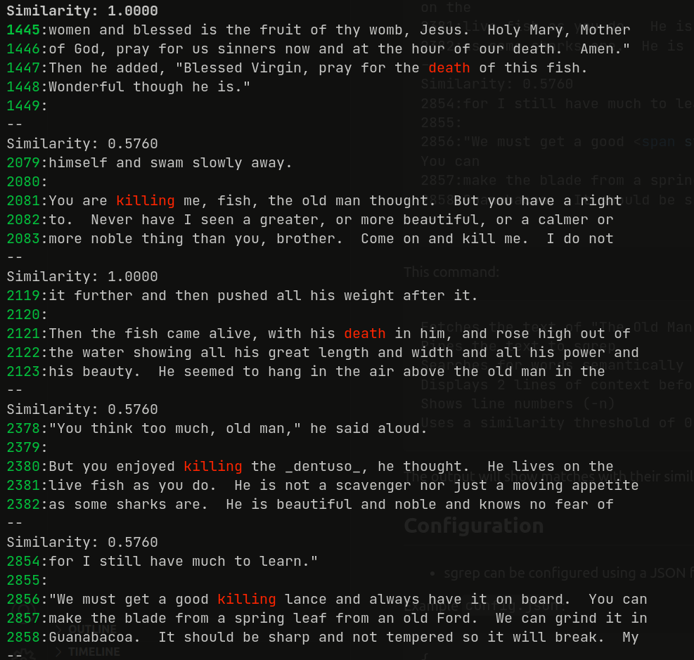

# sgrep - Semantic Grep

sgrep is a command-line tool that performs semantic searches on text input using word embeddings. It's designed to find semantically similar matches to the query, going beyond simple string matching. Supports word2vec and glove models. The experience is designed to be similar to grep. 

## Example Usage

Search for words similar to "death" in Hemingway's "The Old Man and the Sea" with context and line numbers:

```bash
curl -s 'https://gutenberg.ca/ebooks/hemingwaye-oldmanandthesea/hemingwaye-oldmanandthesea-00-t.txt' \
    | sgrep -C 2 -n -threshold 0.55 death
```

Output:


This command:

    - Fetches the text of "The Old Man and the Sea" from Project Gutenberg Canada
    - Pipes the text to sgrep
    - Searches for words semantically similar to "death"
    - Uses a similarity threshold of 0.55 (-threshold 0.55)
    - Displays 2 lines of context before and after each match (-C 2)
    - Shows line numbers (-n)

The output will show matches with their similarity scores, highlighted words, context, and line numbers.

## Features

- Semantic search using word embeddings (word2vec and glove support out of the box)
- Configurable similarity threshold
- Context display (before and after matching lines)
- Color-coded output for matched words and line numbers
- Support for reading from files or standard input
- Configurable via JSON file and command-line arguments

## Installation

**Using install script**:

```bash
# clone
git clone https://github.com/arunsupe/semantic-grep.git
cd semantic-grep

# run install:
#   compiles using the local go compiler, installs in user/bin, 
#   downloads the model to $HOME/.config/semantic-grep
#   makes config.json
bash install.sh
``` 
**Binary**:

1. Download the latest binary release
2. Download a word2vec model (see below)
3. Optionally, download the config.json to configure model location there (or do this from the command line)

**From source (linux/osx)**:

```bash
# clone
git clone https://github.com/arunsupe/semantic-grep.git
cd semantic-grep

# build
go build -o sgrep

# download a word2vec model using this helper script (see "Word Embedding Model" below)
bash download-model.sh
```

## Usage

Basic usage:

./sgrep [options] <query> [file]

If no file is specified, sgrep reads from standard input.

### Command-line Options

- `-model_path`: Path to the Word2Vec model file (overrides config file)
- `-threshold`: Similarity threshold for matching (default: 0.7)
- `-A`: Number of lines to display after a match
- `-B`: Number of lines to display before a match
- `-C`: Number of lines to display before and after a match
- `-n`: Print line numbers

## Configuration

- sgrep can be configured using a JSON file. By default, it looks for `config.json` in the current directory.

Example `config.json`:

```json
{
    "model_path": "path/to/your/word2vec/model.bin"
}
```

## Word Embedding Model
`sgrep` requires a word embedding model in __binary__ format. You can use pre-trained models (like Google's Word2Vec, or Stanford NLP's GloVe) or train your own using tools like gensim. 
- Download and unzip the .bin file locally and update the config.json.
    - Google's Word2Vec: from https://github.com/mmihaltz/word2vec-GoogleNews-vectors
    - A slim version: GoogleNews-vectors-negative300-SLIM.bin.gz model from https://github.com/eyaler/word2vec-slim/ (thanks to eyaler)
    - Stanford NLP group's Global Vectors for Word Representation (glove) model is in text format at the [source](https://nlp.stanford.edu/projects/glove/). Note: this has to be converted to binary format. I am working on making this available for download. 
- download-model.sh is a simple helper script to download the small word2vec model hosted by eyaler and save it in models/googlenews-slim/ directory


## A word about word2vec vs glove
Word2Vec focuses on local context (words occuring close to each other in text) while GloVe leverages global co-occurrence statistics ([explaination](https://machinelearninginterview.com/topics/natural-language-processing/what-is-the-difference-between-word2vec-and-glove/)). For practical purposes, they seem equivalent.


## Contributing
Contributions are welcome! Please feel free to submit a Pull Request.

## License
This project is licensed under the MIT License - see the LICENSE file for details.